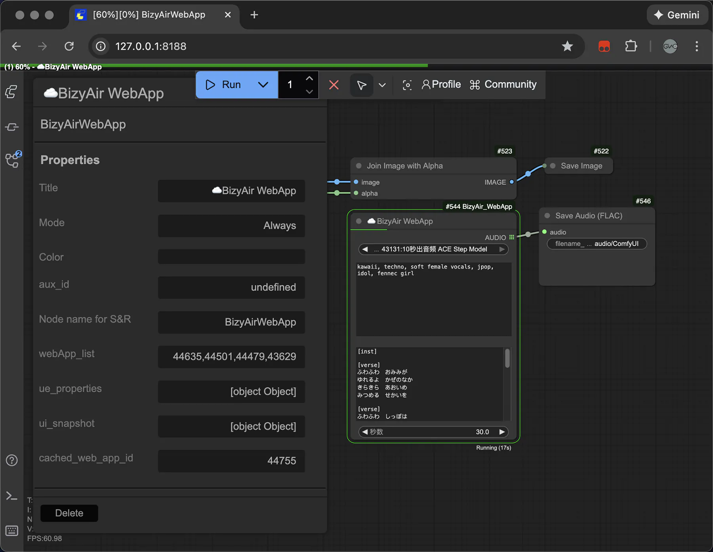
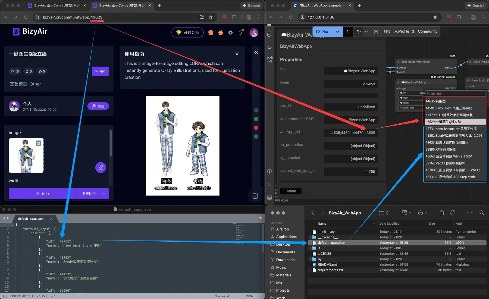
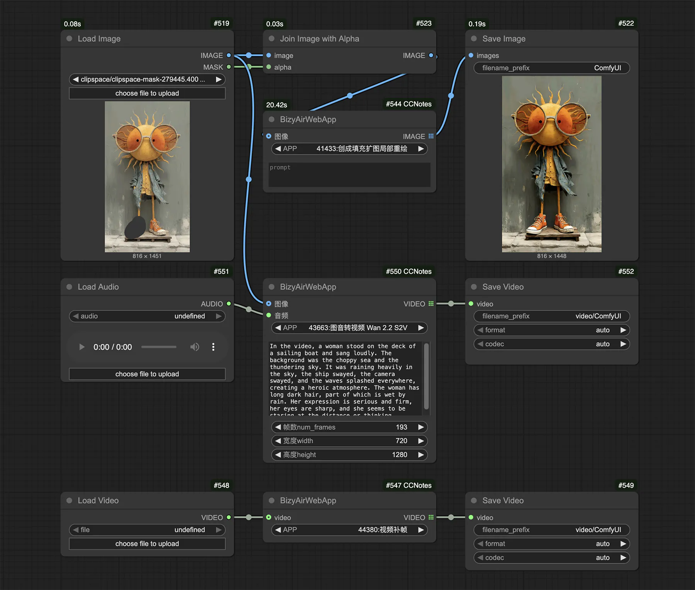

# ComfyUI ☁️BizyAir WebApp

[English](#english) | [中文](#chinese)

<a name="english"></a>
## English

A standalone ComfyUI node for running BizyAir Web Apps.



### Installation

1. Clone this repository into your `ComfyUI/custom_nodes` folder:
    ```bash
    git clone https://github.com/Ginolazy/ComfyUI_BizyAir_App.git
    ```
2. Install dependencies:
    ```bash
    pip install -r requirements.txt
    ```

**Note:** Before use, please install the official Bizyair plugin (https://github.com/siliconflow/BizyAir). ☁️BizyAir WebApp will automatically sync the API key from the official Bizyair plugin, no further configuration is needed..

### Usage
- Add the `☁️BizyAir WebApp` node to your workflow.



- **Add App ID**: 
- Go to https://bizyair.cn/community?path=app to get the app ID you want to use (the 6-digit number at the end of the URL).
    - Method 1: Right-click on the node -> Properties Panel -> Edit `webApp_list`, entering IDs separated by commas.
    - Method 2: Create a `default_apps.json` in the plugin directory to pre-load apps.


- **Handling Masks (RGBA)**: 
If the App requires a mask input, simply use the native ComfyUI `Join Image with Alpha` node to combine your image and mask into an RGBA image, then connect it to the `☁️BizyAir WebApp` node.

### Features
- Incremental App List Sync
- Dynamic Widget Generation
- Support for Image, Video, and Audio inputs/outputs

### License & Usage
- **Image Features**: ✨ **Completely Free & Unlimited**.
- **Audio & Video (Pro)**: Nodes with **(Pro)** suffix are subject to a **free trial limit of 5 runs per day** (resets at UTC 0).
- **Dual Licensing**: Your [BizyAir API Key](https://bizyair.cn) pays for cloud compute. **This plugin's Pro license does NOT include cloud credits**; it is separate and only required for advanced audio/video features provided by this node.
- **Get Pro License**: For unlimited Pro runs, please contact:
  - **Email**: ginolazy@gmail.com
  - **WeChat**: Ginolazy
- **How to Activate**: Right-click the `☁️BizyAir WebApp` node -> `🔑 Activate License`.



---

<a name="chinese"></a>
## 中文说明

一个用于在 ComfyUI 中运行 BizyAir Web App 的独立节点。


### 安装方法

1. 将此仓库克隆到您的 `ComfyUI/custom_nodes` 文件夹中：
    ```bash
    git clone https://github.com/Ginolazy/ComfyUI_BizyAir_App.git
    ```
2. 安装依赖：
    ```bash
    pip install -r requirements.txt
    ```

**注意：** 在使用前，请确保已安装官方 Bizyair 插件 (https://github.com/siliconflow/BizyAir)。BizyAir_WebApp 会自动从官方插件中同步 API Key，无需再另外配置。

### 使用说明
- 在工作流中添加 `☁️BizyAir WebApp` 节点。


- **添加 App ID**: 
- 前往 https://bizyair.cn/community?path=app 获取您想要使用的 App ID（URL 末尾的 6 位数字）。
    - 方法 1: 右键点击节点 -> Properties Panel -> 编辑 `webApp_list`，输入 ID（多个 ID 用逗号分隔）。
    - 方法 2: 在插件目录下创建 `default_apps.json` 文件来预加载 App。


- **处理遮罩 (RGBA)**:
如果 App 需要 Mask 输入，只需使用 ComfyUI 原生的 `Join Image with Alpha` 节点将 `image` 和 `mask` 合成 RGBA 图像后，连接到 `☁️BizyAir WebApp` 节点即可。

### 功能特性
- 增量 App 列表同步
- 动态组件生成
- 支持图片、视频和音频的输入/输出处理

### 授权与使用规则
- **图像相关功能**: ✨ **完全免费，不限次数**。
- **音视频功能 (Pro)**: 带有 **(Pro)** 标识的节点每日提供 **5 次免费额度**（每日 UTC 0 点重置）。
- **双重授权逻辑**: 您自己的 [BizyAir API Key](https://bizyair.cn) 负责支付云端算力；本插件的授权仅用于解锁音视频 Pro 模块的增强功能，**授权不包含任何云端点数/额度**。
- **获取 Pro 授权**: 如需无限次 Pro 调用，请联系作者：
  - **电子邮件**: ginolazy@gmail.com
  - **微信 (WeChat)**: Ginolazy
- **激活方式**: 右键点击 `☁️BizyAir WebApp` 节点 -> 选择 `🔑 Activate License` 即可输入 Key。


